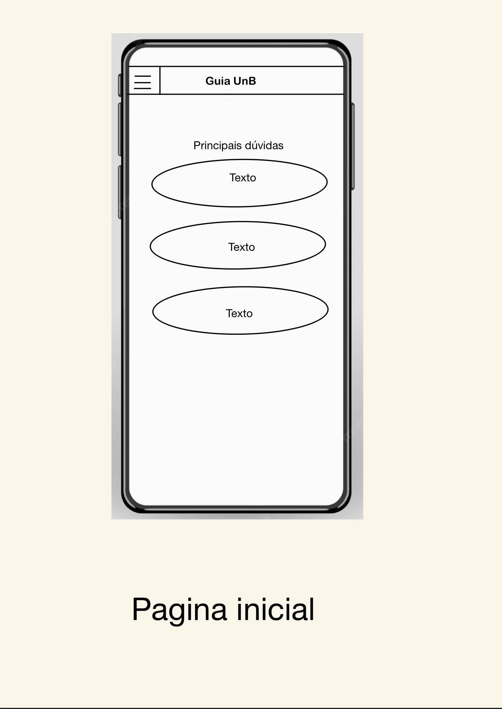
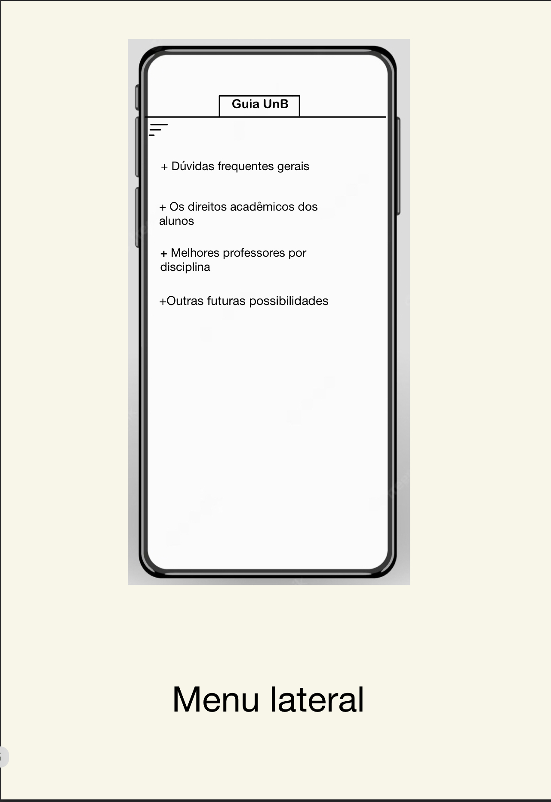
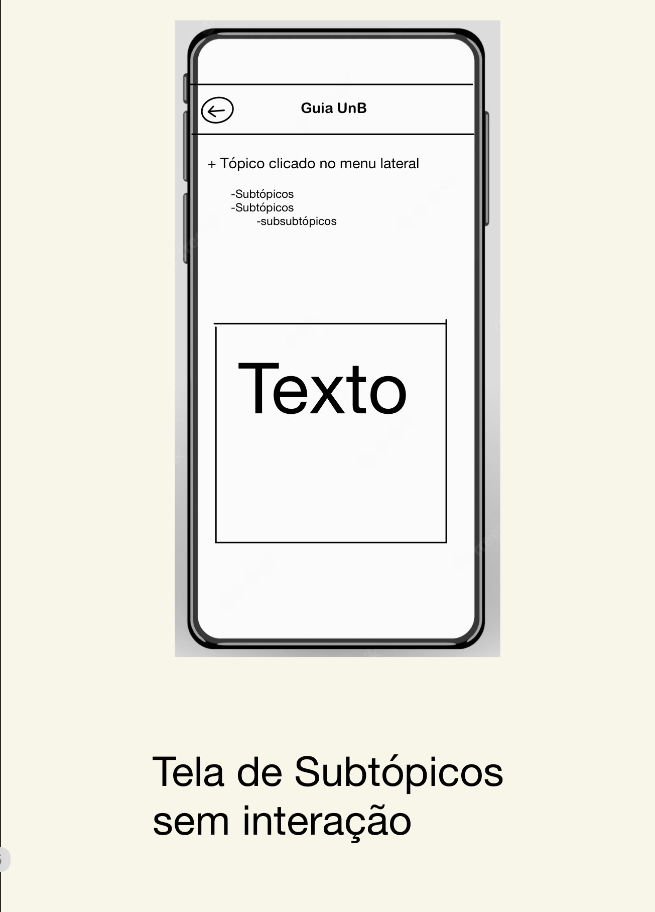
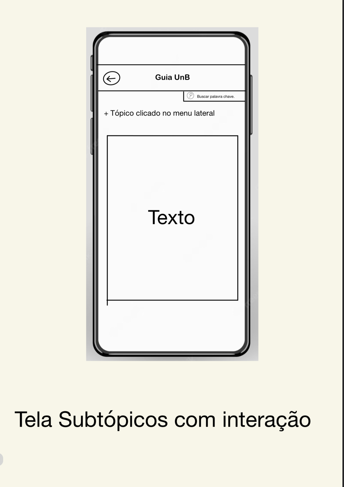
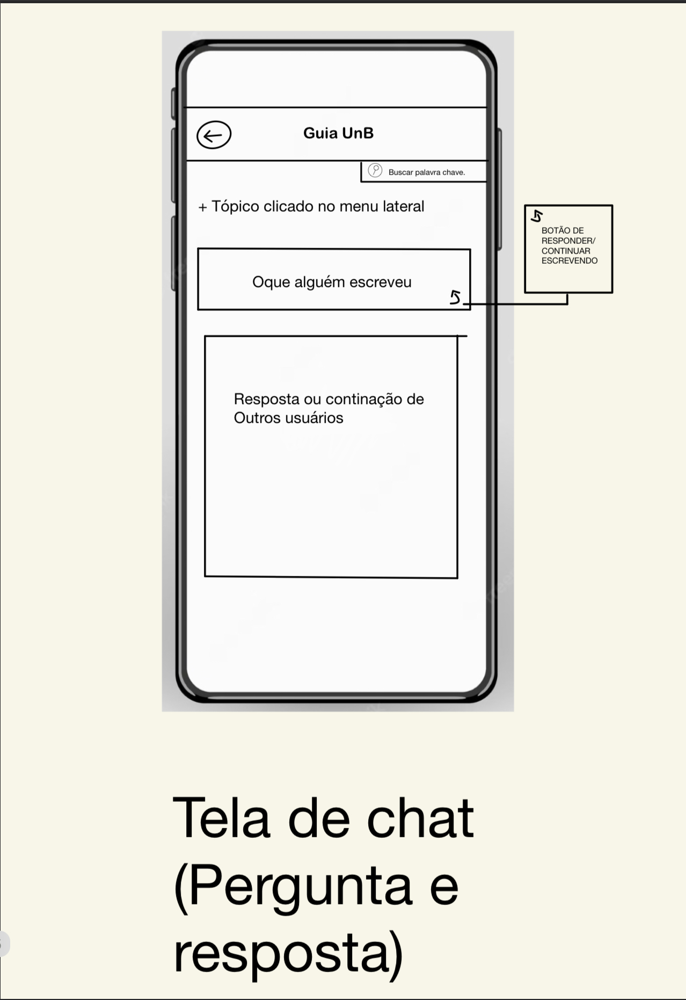

| Data       | Versão | Descrição                      | Autor |
| :--------: | :----: | :----------------------------: | :-------: |
| 13/05/2023 |  0.1   |     Abertura do documento      | [Lucas Avelar](https://github.com/LucasAvelar2711) |
| 16/05/2023 |  0.2   |     Organização do Documento   | [Alexandre Beck](https://github.com/zzzBECK) |
| 19/05/2023 |  0.3  |     Adição do Protótipo de Alta Fidelidade   | [Thiago Freitas](https://github.com/thiagorfreitas) |

## 1.Introdução

Neste documento constam os Protótipos de Alta e Baixa Fidelidade desenvolvidos para melhor visualização da ideia do Guia UnB e informações acerca do contexto e desenvolvimento dos mesmos, com o objetivo de desenvolver estratégias e sintetizar ideias do grupo acerca da visualização do produto. Além disso, no protótipo de alta fidelidade é possível visualizar a interação do usuário com o produto e a identidade visual da aplicação.

## 2.Protótipo de Baixa Fidelidade

Criado por [Lucas Avelar](https://github.com/LucasAvelar2711)

## 3.Protótipo de Alta Fidelidade

Desenvolvido a partir da ideia inicial dos protótipos de baixa fidelidade.

Visualize na janela abaixo ou [clique aqui](https://www.figma.com/proto/4NufbdvSRVBk144XWrsgFA/GuiaUnB?type=design&node-id=8-18934&scaling=scale-down&page-id=1%3A43095&starting-point-node-id=8%3A18934&show-proto-sidebar=1).

<iframe style="border: 1px solid rgba(0, 0, 0, 0.1);" width="800" height="450" src="https://www.figma.com/embed?embed_host=share&url=https%3A%2F%2Fwww.figma.com%2Fproto%2F4NufbdvSRVBk144XWrsgFA%2FGuiaUnB%3Ftype%3Ddesign%26node-id%3D8-18934%26scaling%3Dscale-down%26page-id%3D1%253A43095%26starting-point-node-id%3D8%253A18934%26show-proto-sidebar%3D1" allowfullscreen></iframe>

Criado por [Thiago Freitas](https://github.com/thiagorfreitas) e [Arthur Gabriel](https://github.com/ArthurGabrieel)