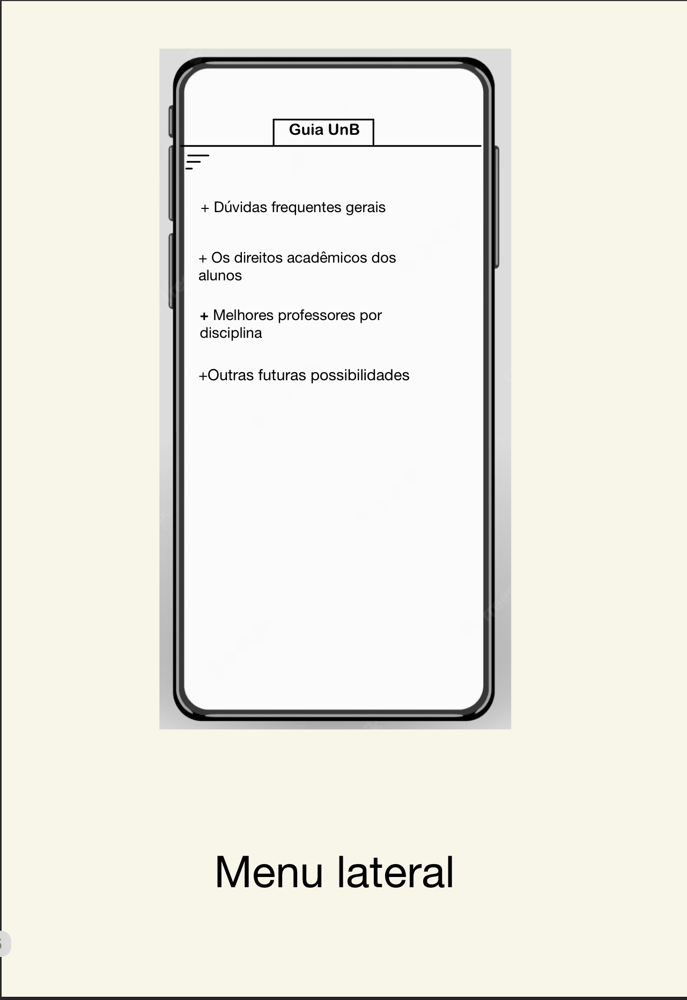
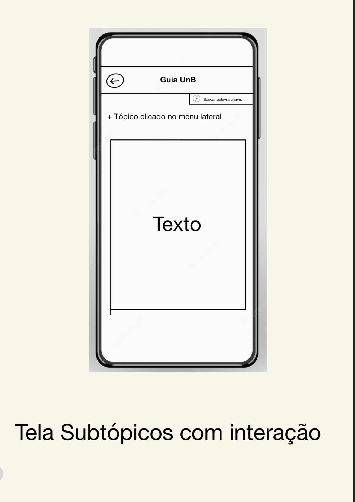
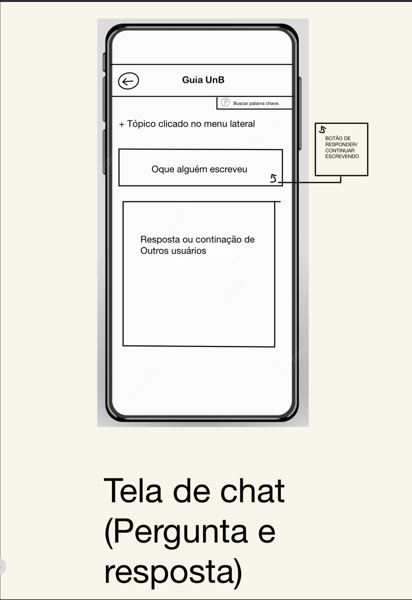

| Data       | Versão | Descrição                      | Autor |
| :--------: | :----: | :----------------------------: | :-------: |
| 13/05/2023 |  0.1   |     Abertura do documento      | [Lucas Avelar](https://github.com/LucasAvelar2711) |
| 16/05/2023 |  0.2   |     Organização do Documento   | [Alexandre Beck](https://github.com/zzzBECK) |

## 1.Introdução

Neste documento consta o Protótipo de Baixa Fidelidade desenvolvidos para melhor visualização da ideia do Guia UnB e informações acerca do contexto e desenvolvimento dos mesmos, com o objetivo de desenvolver estratégias e sintetizar ideias do grupo acerca da visualização do produto.

## 2.Protótipo de Baixa Fidelidade

Criado por [Lucas Avelar](https://github.com/LucasAvelar2711)